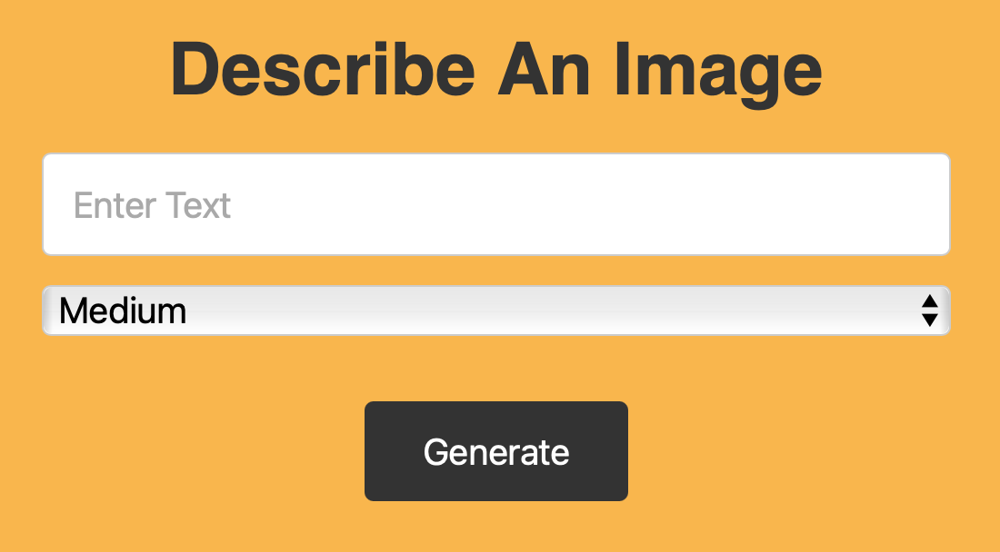

# AI Image Generator

AI Image Generator with OpenAI and Node.js

## Description

This project uses the OpenAI API to generate images based on a prompt. The prompt is a description of the image you want to generate. The API will then generate an image based on the prompt. There are 3 different image sizes to choose from (small, medium, large). The images are generated using the [DALL-E](https://openai.com/blog/dall-e/) model.

---

## How it looks

---

## Installation

First get your API key from [OpenAI](https://openai.com/).

Add the key to the .env file.

A prerequisite for this project is to have [Node.js](https://nodejs.org/en/) installed.

Then run the following commands in the terminal:

- npm run dev
- localhost:5000 in web browser

---
